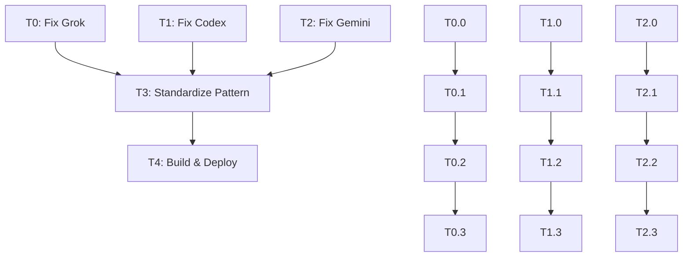

# Blueprint: Worker Task Parameter Standardization

```yaml
blueprint:
  id: bp-outpost-worker-task-param-fix
  version: 1.0.0
  created: 2026-01-14
  author: Claude Opus 4.5
  status: DRAFT

metadata:
  project: outpost
  component: containers
  priority: CRITICAL
  estimated_effort: 4-6 hours
  depth: 4

context:
  problem: |
    3 of 5 Outpost fleet agents fail to execute tasks despite control plane
    correctly injecting TASK environment variable. Root cause: inconsistent
    task parameter reading patterns across worker entrypoints.

  evidence:
    - claude_success: "Reads ${TASK} from environment - WORKS"
    - aider_success: "Reads ${TASK} from environment - WORKS"
    - grok_failure: "Only checks --task CLI arg, not env - FAILS"
    - codex_failure: "Requires TTY/stdin mode - FAILS"
    - gemini_failure: "Exit code 42, CLI arg issue - FAILS"

  root_cause: |
    Control plane (task-launcher.ts:349) correctly sets TASK environment
    variable in ECS container overrides. However, Grok/Codex/Gemini worker
    entrypoints do not read from environment, only from CLI args or stdin.
```

---

## Overview

### Problem Statement

Outpost v2.0 ECS control plane correctly injects task parameters via environment variables to worker containers. However, 3 of 5 agents (Grok, Codex, Gemini) fail with task-related errors because their entrypoints expect CLI arguments or stdin input rather than environment variables.

### Success Criteria

- All 5 agents successfully execute tasks dispatched via HTTP API
- Standardized task parameter reading pattern: environment variable with CLI fallback
- Zero breaking changes to existing Claude/Aider agents
- All container builds pass and deploy successfully

### Architecture Context

```
┌─────────────────────────────────────────────────────────────────┐
│ Control Plane (task-launcher.ts)                                │
│                                                                 │
│   const env: KeyValuePair[] = [                                │
│     { name: 'TASK', value: request.task },  ◄── CORRECTLY SET  │
│   ];                                                            │
│                                                                 │
│   containerOverrides: [{ environment: env }]                   │
└───────────────────────────┬─────────────────────────────────────┘
                            │
                            ▼
┌─────────────────────────────────────────────────────────────────┐
│ Worker Containers                                               │
│                                                                 │
│   ✅ Claude: if [[ -n "${TASK:-}" ]]; then exec claude "$TASK" │
│   ✅ Aider:  TASK="${TASK:-}" && aider --message "$TASK"       │
│   ❌ Grok:   if args.task: task = args.task  # NO ENV CHECK    │
│   ❌ Codex:  Requires TTY stdin mode                            │
│   ❌ Gemini: CLI args only, no env fallback                     │
└─────────────────────────────────────────────────────────────────┘
```

---

## Task Tree

### T0: Fix Grok Agent Task Parameter Reading
**Priority:** P0 (Critical)
**Status:** TODO
**Assignee:** TBD

#### T0.0: Analyze Current Grok Implementation
**File:** `containers/grok/grok-agent.py`
**Lines:** 268-286

```python
# CURRENT (BROKEN)
if args.stdin:
    task = sys.stdin.read().strip()
elif args.task:
    task = args.task
else:
    print("ERROR: No task provided. Use --task or --stdin", file=sys.stderr)
    return 1
```

**Acceptance Criteria:**
- [ ] Identify all locations where task parameter is read
- [ ] Document current CLI argument parsing logic
- [ ] Identify any task validation logic

#### T0.1: Add Environment Variable Reading
**File:** `containers/grok/grok-agent.py`

```python
# TARGET (FIXED)
import os

# In main() or run() function:
task = None

# Priority 1: Environment variable (ECS injection)
if os.environ.get('TASK'):
    task = os.environ['TASK']
# Priority 2: CLI argument
elif args.task:
    task = args.task
# Priority 3: Stdin (legacy/testing)
elif args.stdin:
    task = sys.stdin.read().strip()

if not task:
    print("ERROR: No task provided. Set TASK env var, use --task, or --stdin", file=sys.stderr)
    return 1
```

**Acceptance Criteria:**
- [ ] Environment variable takes priority over CLI args
- [ ] Existing --task and --stdin flags still work
- [ ] Clear error message when no task provided
- [ ] Task string properly stripped/sanitized

#### T0.2: Update Grok Entrypoint Script
**File:** `containers/grok/entrypoint-grok.sh`

Ensure entrypoint passes through environment correctly:

```bash
#!/bin/bash
set -euo pipefail

# Log task source for debugging
if [[ -n "${TASK:-}" ]]; then
    echo "[grok-agent] Task received via environment variable"
    echo "[grok-agent] Task length: ${#TASK} chars"
fi

# Execute Python agent (reads TASK from env)
exec python3 /app/grok-agent.py "$@"
```

**Acceptance Criteria:**
- [ ] Entrypoint logs task source for debugging
- [ ] Environment variables passed through to Python
- [ ] Exec used to replace shell process

#### T0.3: Test Grok Agent Locally
**Commands:**
```bash
cd containers/grok
docker build -t outpost-grok:test .
docker run --rm -e TASK="Write hello world in Python" outpost-grok:test
```

**Acceptance Criteria:**
- [ ] Container builds successfully
- [ ] Task executes when TASK env var set
- [ ] Existing --task flag still works
- [ ] Existing --stdin mode still works
- [ ] Error message when no task provided

---

### T1: Fix Codex Agent TTY Requirement
**Priority:** P0 (Critical)
**Status:** TODO
**Assignee:** TBD

#### T1.0: Analyze Codex TTY Dependency
**File:** `containers/codex/entrypoint-codex.sh`
**Error:** `Error: stdin is not a terminal`

The Codex CLI requires TTY for interactive mode. ECS tasks do not allocate TTY by default.

**Investigation Points:**
- [ ] Identify which Codex CLI flag requires TTY
- [ ] Check if non-interactive mode available
- [ ] Review Codex SDK for programmatic API

#### T1.1: Implement Non-Interactive Mode
**File:** `containers/codex/entrypoint-codex.sh`

Options to investigate:
1. `--non-interactive` flag (if available)
2. `script` command to fake TTY
3. `unbuffer` from expect package
4. Replace CLI with SDK/API calls

```bash
#!/bin/bash
set -euo pipefail

# Read task from environment
TASK="${TASK:-}"
if [[ -z "$TASK" ]]; then
    echo "[codex] ERROR: TASK environment variable not set"
    exit 1
fi

# Option 1: Non-interactive flag
codex --non-interactive --task "$TASK"

# Option 2: Fake TTY with script
# script -q -c "codex --task \"$TASK\"" /dev/null

# Option 3: Use unbuffer
# unbuffer codex --task "$TASK"
```

**Acceptance Criteria:**
- [ ] Codex executes without TTY
- [ ] Task read from TASK environment variable
- [ ] Output captured correctly
- [ ] Exit codes propagated

#### T1.2: Update Codex Dockerfile
**File:** `containers/codex/Dockerfile`

If using TTY workaround, add required packages:

```dockerfile
# Add expect for unbuffer (if needed)
RUN apt-get update && apt-get install -y expect && rm -rf /var/lib/apt/lists/*
```

**Acceptance Criteria:**
- [ ] All required packages installed
- [ ] Image size minimized
- [ ] Build completes successfully

#### T1.3: Test Codex Agent Locally
**Commands:**
```bash
cd containers/codex
docker build -t outpost-codex:test .
docker run --rm -e TASK="Explain recursion" outpost-codex:test
```

**Acceptance Criteria:**
- [ ] Container builds successfully
- [ ] Task executes in non-TTY environment
- [ ] Output returned correctly
- [ ] No stdin/TTY errors

---

### T2: Fix Gemini Agent Task Parameter Reading
**Priority:** P0 (Critical)
**Status:** TODO
**Assignee:** TBD

#### T2.0: Analyze Current Gemini Implementation
**File:** `containers/gemini/entrypoint-gemini.sh`
**Exit Code:** 42 (Gemini-specific error)

**Investigation Points:**
- [ ] Review entrypoint script
- [ ] Identify how task is currently passed
- [ ] Check Gemini CLI documentation for env var support

#### T2.1: Add Environment Variable Support
**File:** `containers/gemini/entrypoint-gemini.sh`

```bash
#!/bin/bash
set -euo pipefail

# Read task from environment (priority) or CLI
TASK="${TASK:-$1}"

if [[ -z "$TASK" ]]; then
    echo "[gemini] ERROR: No task provided"
    echo "[gemini] Set TASK environment variable or pass as argument"
    exit 1
fi

echo "[gemini] Executing task: ${TASK:0:100}..."

# Execute Gemini CLI with task
exec gemini-cli prompt "$TASK"
```

**Acceptance Criteria:**
- [ ] Environment variable takes priority
- [ ] CLI argument fallback works
- [ ] Clear error messaging
- [ ] Gemini CLI invoked correctly

#### T2.2: Review Gemini Exit Codes
**Documentation:** Gemini CLI exit codes

| Code | Meaning |
|------|---------|
| 0 | Success |
| 1 | General error |
| 42 | (Investigate - likely missing task or config) |

**Acceptance Criteria:**
- [ ] Exit code 42 root cause identified
- [ ] Proper error handling implemented
- [ ] Exit codes propagated correctly

#### T2.3: Test Gemini Agent Locally
**Commands:**
```bash
cd containers/gemini
docker build -t outpost-gemini:test .
docker run --rm -e TASK="What is 2+2?" -e GOOGLE_API_KEY="$GOOGLE_API_KEY" outpost-gemini:test
```

**Acceptance Criteria:**
- [ ] Container builds successfully
- [ ] Task executes when TASK env var set
- [ ] API key properly injected
- [ ] No exit code 42 errors

---

### T3: Standardize Worker Entrypoint Pattern
**Priority:** P1 (High)
**Status:** TODO
**Assignee:** TBD

#### T3.0: Document Standard Pattern
Create reference implementation based on working Claude entrypoint:

**File:** `containers/ENTRYPOINT_STANDARD.md`

```markdown
# Worker Entrypoint Standard

All Outpost worker containers MUST follow this pattern:

## Environment Variables (Required)
- TASK: The task/prompt to execute (set by control plane)
- DISPATCH_ID: Unique dispatch identifier
- AGENT_TYPE: Agent name (claude, codex, gemini, aider, grok)

## Environment Variables (Optional)
- MODEL_ID: Specific model to use
- GITHUB_TOKEN: For repo cloning
- CONTEXT_LEVEL: minimal|standard|full

## Task Reading Priority
1. TASK environment variable (primary - ECS injection)
2. --task CLI argument (fallback - testing)
3. stdin (legacy - deprecated)

## Reference Implementation (Bash)
```bash
#!/bin/bash
set -euo pipefail

TASK="${TASK:-}"
if [[ -z "$TASK" ]]; then
    echo "[agent] ERROR: TASK environment variable required"
    exit 1
fi

exec <agent-command> "$TASK"
```

## Reference Implementation (Python)
```python
import os
import sys

def get_task(args):
    # Priority 1: Environment variable
    if os.environ.get('TASK'):
        return os.environ['TASK']
    # Priority 2: CLI argument
    if args.task:
        return args.task
    # Priority 3: Stdin (deprecated)
    if args.stdin:
        return sys.stdin.read().strip()
    return None
```
```

**Acceptance Criteria:**
- [ ] Standard documented clearly
- [ ] Examples in Bash and Python
- [ ] Required vs optional env vars specified
- [ ] Priority order documented

#### T3.1: Audit Existing Entrypoints
Compare all entrypoints against standard:

| Agent | File | Reads Env | Reads CLI | Reads Stdin | Compliant |
|-------|------|-----------|-----------|-------------|-----------|
| Claude | entrypoint-claude.sh | ✅ | ❌ | ❌ | ✅ |
| Aider | entrypoint-aider.sh | ✅ | ❌ | ❌ | ✅ |
| Grok | grok-agent.py | ❌ | ✅ | ✅ | ❌ |
| Codex | entrypoint-codex.sh | ? | ? | ? | ❌ |
| Gemini | entrypoint-gemini.sh | ? | ? | ? | ❌ |

**Acceptance Criteria:**
- [ ] All 5 entrypoints audited
- [ ] Compliance status documented
- [ ] Specific fixes identified for each

#### T3.2: Create Shared Entrypoint Library
**File:** `containers/lib/task-reader.sh`

```bash
#!/bin/bash
# Shared task reading logic for all agents

read_task() {
    local task="${TASK:-}"

    if [[ -z "$task" ]]; then
        echo "[task-reader] ERROR: TASK environment variable not set" >&2
        echo "[task-reader] Control plane should inject TASK via ECS overrides" >&2
        return 1
    fi

    echo "[task-reader] Task received (${#task} chars)" >&2
    echo "$task"
}

# Export for sourcing
export -f read_task
```

**Acceptance Criteria:**
- [ ] Shared library created
- [ ] Consistent error messaging
- [ ] Easy to source in entrypoints
- [ ] Works across all agents

#### T3.3: Update All Entrypoints to Use Library
Update each entrypoint to source shared library:

```bash
#!/bin/bash
set -euo pipefail
source /app/lib/task-reader.sh

TASK=$(read_task) || exit 1
exec <agent-command> "$TASK"
```

**Acceptance Criteria:**
- [ ] All 5 entrypoints use shared library
- [ ] Consistent behavior across agents
- [ ] No code duplication

---

### T4: Build, Test, and Deploy
**Priority:** P1 (High)
**Status:** TODO
**Assignee:** TBD

#### T4.0: Update Container Build Scripts
**File:** `containers/build-all.sh`

```bash
#!/bin/bash
set -euo pipefail

AGENTS=("claude" "codex" "gemini" "aider" "grok")
ECR_REGISTRY="535471339422.dkr.ecr.us-east-1.amazonaws.com"

for agent in "${AGENTS[@]}"; do
    echo "Building $agent..."
    docker build -t "outpost-$agent:latest" "containers/$agent/"
    docker tag "outpost-$agent:latest" "$ECR_REGISTRY/outpost-$agent:latest"
done

echo "All containers built successfully"
```

**Acceptance Criteria:**
- [ ] All 5 containers build successfully
- [ ] Images tagged for ECR
- [ ] Build script idempotent

#### T4.1: Local Integration Test
Test all agents locally with TASK env var:

```bash
#!/bin/bash
set -euo pipefail

TASK="Write a hello world function in Python"

for agent in claude codex gemini aider grok; do
    echo "Testing $agent..."
    docker run --rm \
        -e TASK="$TASK" \
        -e DISPATCH_ID="test-$(date +%s)" \
        "outpost-$agent:latest"
done
```

**Acceptance Criteria:**
- [ ] All 5 agents execute task
- [ ] No TTY/stdin errors
- [ ] Output captured correctly
- [ ] Exit codes correct

#### T4.2: Push to ECR
```bash
#!/bin/bash
aws ecr get-login-password --region us-east-1 --profile soc | \
    docker login --username AWS --password-stdin 535471339422.dkr.ecr.us-east-1.amazonaws.com

for agent in claude codex gemini aider grok; do
    docker push "535471339422.dkr.ecr.us-east-1.amazonaws.com/outpost-$agent:latest"
done
```

**Acceptance Criteria:**
- [ ] All images pushed to ECR
- [ ] Tags correct
- [ ] No authentication errors

#### T4.3: Deploy and Validate
Test via Outpost HTTP API:

```bash
# Test each agent
for agent in claude codex gemini aider grok; do
    curl -X POST "$OUTPOST_ALB_ENDPOINT/dispatch" \
        -H "Content-Type: application/json" \
        -H "X-API-Key: $OUTPOST_API_KEY" \
        -d "{\"agent\": \"$agent\", \"task\": \"Return the number 42\"}"
done
```

**Acceptance Criteria:**
- [ ] All 5 dispatches succeed
- [ ] Tasks execute correctly
- [ ] Results returned
- [ ] No TIMEOUT or FAILED statuses

#### T4.4: Monitor CloudWatch Logs
Verify no errors in production:

```bash
aws logs tail /outpost/workers --follow --profile soc
```

**Acceptance Criteria:**
- [ ] No task-related errors
- [ ] TASK env var logged correctly
- [ ] All agents reporting success

---

## Dependencies



## Rollback Plan

If issues arise post-deployment:

1. **Revert ECR Images:**
   ```bash
   # Tag previous working images
   for agent in claude aider; do  # Only these were working
       aws ecr batch-get-image --repository-name outpost-$agent \
           --image-ids imageTag=previous --profile soc
   done
   ```

2. **Force ECS Service Update:**
   ```bash
   aws ecs update-service --cluster outpost-cluster \
       --service outpost-workers --force-new-deployment --profile soc
   ```

3. **Monitor Recovery:**
   ```bash
   aws ecs describe-services --cluster outpost-cluster \
       --services outpost-workers --profile soc
   ```

---

## Success Metrics

| Metric | Before | After | Target |
|--------|--------|-------|--------|
| Agent Success Rate | 40% (2/5) | 100% (5/5) | 100% |
| Dispatch Failures | 60% | 0% | 0% |
| Task Parameter Errors | 3 agents | 0 agents | 0 |
| Entrypoint Consistency | Inconsistent | Standardized | Standardized |

---

## References

- Control Plane Task Launcher: `src/control-plane/src/services/task-launcher.ts:339-366`
- Working Pattern (Claude): `containers/claude/entrypoint-claude.sh:18-42`
- Broken Pattern (Grok): `containers/grok/grok-agent.py:268-286`
- ECS Task Definitions: `terraform/modules/ecs/task-definitions/`
- Blueprint Spec: `~/projects/blueprint/docs/BLUEPRINT_SPEC.md`

---

**Blueprint Status:** DRAFT
**Generated:** 2026-01-14
**Generator:** Claude Opus 4.5
**Depth:** 4 (very detailed)

---

*Outpost v2.0 — Multi-Agent Fleet Orchestration*
*Zero Echelon LLC — Primary Architect: Richie G. Suarez*
